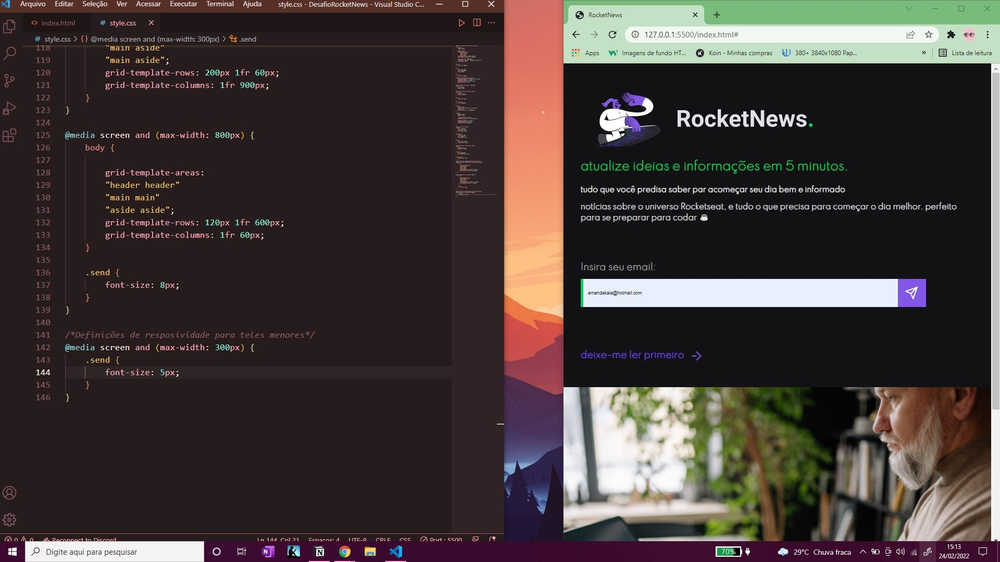
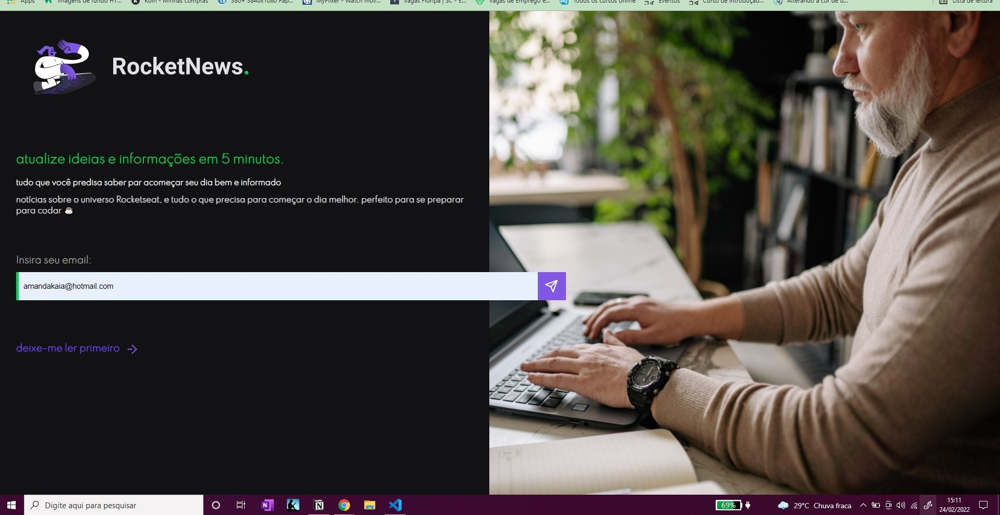

# RocketNews

Essa é uma página newsletter. Mais um projeto proposto pela Rocketseat, confeço que quebrei a cabeça em alguns momentos principalmente para deixar posicionado o form, mas no final foi algo bem simples e deu tudo certo, eu acabei descobrindo que gosto bastante de utilziar o grid rs.

     

 

     

 

     

## Linguagens Utilizadas

 
 

